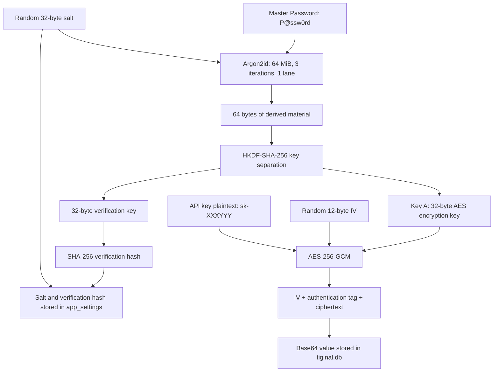
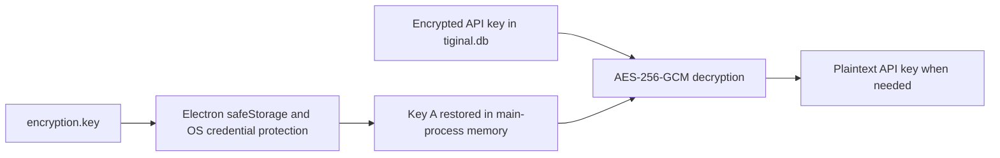

# Master Key Encryption Explained

This document explains exactly what Tiginal stores, how its Master Password is used, how API keys are encrypted, how automatic unlock works, and what this design can and cannot protect.

The examples use these two values:

```text
Master Password: P@ssw0rd
OpenAI API Key:  sk-XXXYYY
```

## The most important distinction

The Settings UI calls `P@ssw0rd` the Master Key, but cryptographically it is a **Master Password**. It is human-readable input, not the AES key that encrypts the API key.

A useful simplified mental model is:

```text
P@ssw0rd -> derive Key A -> Key A encrypts sk-XXXYYY
```

`Key A` is not another password. It is 32 bytes of binary key material derived from the Master Password. It is never typed by the user.

If the name "Password A" makes the model easier to remember, then Password A corresponds to Key A in this document. The important correction is that it is a binary AES key derived from `P@ssw0rd`, not a second human password encrypted by `P@ssw0rd`.

The exact implementation does **not** do this:

```text
P@ssw0rd -> encrypt a second password -> second password encrypts sk-XXXYYY
```

Instead, Argon2id and HKDF mathematically derive `Key A` from `P@ssw0rd` and a random salt. `Key A` then encrypts `sk-XXXYYY` directly with AES-256-GCM.



## Step 1: setting the Master Password

When `P@ssw0rd` is configured for the first time, Tiginal generates a random 32-byte salt. A salt is public random data. Its purpose is to make the derived key unique even when two users choose the same password.

For example, two installations that both use `P@ssw0rd` receive different salts and therefore produce different  `Key A` values.

The salt is stored in the SQLite `app_settings` table:

```text
key:   master_password_salt
value: a 64-character hexadecimal representation of 32 random bytes
```

The value is not secret. An attacker who copies the database is expected to be able to see it.

## Step 2: deriving cryptographic keys with Argon2id

Tiginal feeds the following values into Argon2id:

```text
password:    P@ssw0rd
salt:        random 32-byte salt
memory cost: 65,536 KiB, which is 64 MiB
time cost:   3 iterations
parallelism: 1 lane
output:      64 bytes
```

Argon2id is a password-based key derivation function. Its job is to turn a human password into high-entropy binary material while making password guesses expensive in memory and CPU time.

Argon2id is not encryption. There is no Argon2id operation that reverses the 64-byte result back into `P@ssw0rd`. To test a candidate password, Tiginal must run the derivation again with the same salt and compare a verification result.

The 64-byte Argon2id output is temporary intermediate material. It is not written to the SQLite database.

## Step 3: separating Key A from the verification key

The 64-byte Argon2id result is passed through HKDF-SHA-256 twice with two different context labels:

```text
HKDF label "encryption"   -> Key A, 32 bytes
HKDF label "verification" -> verification key, 32 bytes
```

This separation prevents the same key bytes from being reused for two different purposes.

`Key A` is the actual AES-256 encryption key. It encrypts and decrypts protected values such as `sk-XXXYYY`.

The verification key is hashed once more with SHA-256. Only the resulting hash is stored in the SQLite `app_settings` table:

```text
key:   master_password_hash
value: a 64-character hexadecimal SHA-256 hash
```

Tiginal does not store `P@ssw0rd` in the database. During a manual unlock it derives the verification key again, hashes it, and compares that hash with the stored value. A match means the entered password produced the same keys.

The stored salt and verification hash allow offline password guessing. Argon2id makes each guess more expensive, but it cannot make a weak password strong.

## Step 4: encrypting `sk-XXXYYY` with Key A

Tiginal encrypts each protected value independently with AES-256-GCM.

AES-256 means `Key A` is 256 bits, or 32 bytes. GCM provides both confidentiality and authentication:

- Confidentiality hides `sk-XXXYYY`.
- Authentication detects a modified IV, authentication tag, or ciphertext.

For every encryption, Tiginal generates a fresh random 12-byte IV. The IV does not need to be secret, but it must not be reused with the same `Key A`.

AES-GCM produces:

```text
IV:                 12 bytes
authentication tag: 16 bytes
ciphertext:          same byte length as the plaintext
```

`sk-XXXYYY` contains 9 ASCII characters, so its ciphertext is 9 bytes. The complete binary record is therefore:

```text
12-byte IV + 16-byte authentication tag + 9-byte ciphertext = 37 bytes
```

Tiginal Base64-encodes those 37 bytes before placing them in the `api_key_encrypted` column. A 37-byte value becomes a 52-character Base64 string.

```text
ai_providers.api_key_encrypted =
Base64(IV || authentication tag || ciphertext)
```

The stored value is not a hash. It is reversible authenticated ciphertext. Tiginal can recover `sk-XXXYYY` when it has `Key A`.

Encrypting the same `sk-XXXYYY` twice produces different database values because each encryption uses a new random IV.

## Step 5: decrypting the API key for a request

When Tiginal needs the API key, it:

1. Reads the Base64 value from SQLite.
2. Base64-decodes it into bytes.
3. Reads the first 12 bytes as the IV.
4. Reads the next 16 bytes as the authentication tag.
5. Treats all remaining bytes as ciphertext.
6. Passes `Key A`, the IV, the tag, and the ciphertext to AES-256-GCM.
7. Receives `sk-XXXYYY` only if authentication succeeds.
8. Places the plaintext into the provider request, normally as an `Authorization` header.

At this point `sk-XXXYYY` exists temporarily as plaintext in process memory. Encryption at rest cannot prevent this because the provider must receive the real API key.

With a correctly validated HTTPS endpoint, TLS encrypts the complete HTTP request before it travels over the network. A passive packet capture normally cannot read the API key. A local process with enough privilege to inspect or modify Tiginal before TLS encryption may still obtain it.

## What is stored and where

On macOS and Linux, the relevant files are:

```text
~/.config/tiginal/data/tiginal.db
~/.config/tiginal/encryption.key
```

On Windows, they are stored below:

```text
%APPDATA%\Tiginal\data\tiginal.db
%APPDATA%\Tiginal\encryption.key
```

The storage model is:

| Value | Persistent location | Persistent representation |
|---|---|---|
| `P@ssw0rd` | Nowhere | The plaintext Master Password is not intentionally persisted |
| Random salt | `tiginal.db`, `app_settings` | 32 random bytes encoded as hexadecimal |
| Verification hash | `tiginal.db`, `app_settings` | SHA-256 hash encoded as hexadecimal |
| `sk-XXXYYY` | `tiginal.db`, `ai_providers` | AES-256-GCM ciphertext encoded as Base64 |
| Key A | `encryption.key` | Key A encoded as Base64 and encrypted by Electron `safeStorage` |

While Tiginal is unlocked, `Key A` is also held in a 32-byte Buffer in the Electron main process. `P@ssw0rd` exists temporarily in the renderer and main process during setup or manual unlock. `sk-XXXYYY` exists temporarily whenever it is entered, displayed, decrypted, or used in a provider request.

JavaScript strings are managed by garbage collection, so clearing an input does not guarantee that every old plaintext copy is immediately overwritten in physical memory.

## Automatic unlock and `encryption.key`

After a successful setup or manual unlock, Tiginal asks Electron `safeStorage` to encrypt the Base64 representation of `Key A`. The resulting value is protected by operating system credential facilities and written to `encryption.key`.

The auto-unlock flow is:



`encryption.key` does not contain `P@ssw0rd` or `sk-XXXYYY`. It contains an operating-system-protected copy of `Key A`.

This means the Master Password is not required on every launch. Tiginal can ask the operating system to recover `Key A` and auto-unlock. The exact strength and access rules of `safeStorage` depend on the operating system and the security of the logged-in user account.

The Lock action clears the current in-memory Key A Buffer. It does not delete `encryption.key`, so a later application restart can auto-unlock again.

## Changing the Master Password

The Change action is available only while the Master Key is unlocked. Because the old `Key A` is already in memory, the dialog asks for the new password twice and does not ask for the old password again.

For example, changing from `P@ssw0rd` to `MyNewPassword` performs these steps:

1. Decrypt every protected API key and SSH secret with the old `Key A`.
2. Generate a new random 32-byte salt.
3. Run Argon2id with `MyNewPassword` and the new salt.
4. Derive a new `Key A` and a new verification key with HKDF-SHA-256.
5. Encrypt every protected value with the new `Key A` and a new random IV.
6. In one SQLite transaction, replace all protected ciphertext, the salt, and the verification hash.
7. Replace the operating-system-protected Key A in `encryption.key`.
8. Overwrite the old in-memory `Key A` Buffer with zeroes.

All existing encrypted values must decrypt successfully before the rotation begins. If re-encryption or the SQLite transaction fails, the transaction is rolled back, the new key is cleared, and the old `Key A` remains active.

If the database rotation succeeds but `safeStorage` cannot save the new `Key A`, Tiginal removes the stale auto-unlock file. The new password and newly encrypted database remain valid, but the new password must be entered after restart.

## What the Master Password currently protects

The current encrypted fields are:

- AI provider API keys
- SSH passwords or private-key credentials
- SSH private-key passphrases

SSH connection support is still under development, but its credential fields already use the same encryption service.

The Master Password does not currently encrypt:

- Provider endpoints and model settings
- Custom HTTP headers
- MCP server configuration and environment variables
- Chat messages
- Command history
- System prompts
- General application settings

Secrets should not be placed in custom headers or MCP environment variables until those fields have explicit encrypted storage.

## Security boundaries

This design primarily protects data at rest. The following cases are different:

| Scenario | Expected protection |
|---|---|
| An attacker copies only `tiginal.db` | API keys remain encrypted; the attacker must guess the Master Password or obtain Key A |
| An attacker copies the full config directory | Security also depends on the OS protection around `encryption.key` |
| Tiginal is locked in the current process | Key A is cleared from the active CryptoService, but the saved auto-unlock file remains |
| Tiginal is unlocked | Key A is in memory and protected values can be decrypted by the application |
| Malware can read or inject into Tiginal memory | The malware may obtain Key A or plaintext API keys |
| Malware controls the logged-in OS account | Database encryption provides limited protection because the malware may access the app and OS credential services |
| A passive observer captures normal HTTPS traffic | TLS should hide the API key from the packet capture |
| The provider endpoint uses plain HTTP | The API key may be visible on the network |

The design does not defend against an attacker who can already control the running application, attach a debugger, dump process memory, inject code, capture keyboard input, or use the logged-in operating system account's credential services.

It does make an offline SQLite database substantially safer than storing API keys as plaintext. Its effectiveness still depends on a strong Master Password, operating-system isolation, full-disk encryption, screen locking, software updates, and correctly validated HTTPS connections.
